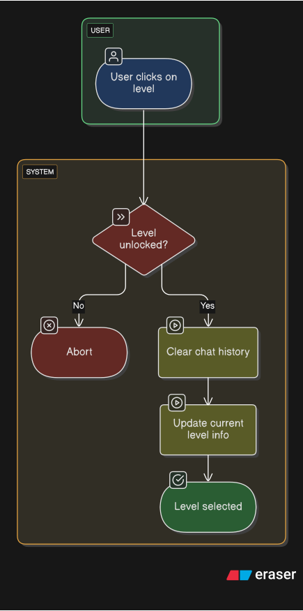

# Level selection

## Description
The user shall be able to select between the different available levels

## Basic Flow of Events
+ User clicks on level
+ Verify whether level is unlocked
+ Clear chat history
+ Update current level info

## Alternative Flows
- Level is not unlocked
    - Abort

## Subflows
n/a

## Preconditions
- The player is logged in

## Postconditions
- The desired level is selected

## Extension points
n/a

## Additional information
n/a

## Wireframe

## Activity diagram

## Gherkin narrative
> TODO
<iframe src="https://emgithub.com/iframe.html?target=https://github.com/cucumber/gherkin/blob/main/testdata/good/extra_table_content.feature&style=default&type=code&showFullPath=on&fetchFromJsDelivr=on" frameborder="0" scrolling="no" style="width:100%; height:290px;" allow="clipboard-write"></iframe>
