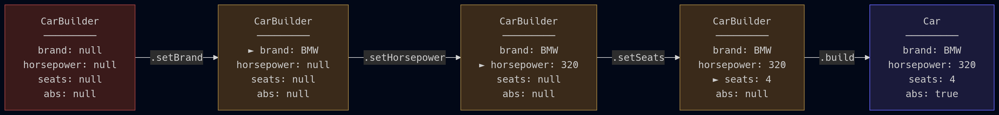

# Semester 2,  Week 2: Design Patterns

Hello everyone!

Today I want to present the [**Builder Design Pattern**](https://en.wikipedia.org/wiki/Builder_pattern) to you.
We make heavy use of this pattern in our backend codebase, which is why we think it is important for you to know too!

## What is a Builder
A builder is used to construct complex objects, which often have many configurable attributes.
Using a builder allows setting these attributes one at a time, or keep the default value, in a very ergonomic manner.

## What's it look like?
Visually represented, this is how a Builder works:



You set each attribute individually (`brand`, `horsepower`, `seats`), or leave the default (`abs`).

Code-wise, using the same builder would look like this:
```java
Car myCar = new Car.Builder()
    .setBrand("BMW")
    .setHorsepower(320)
    .setSeats(4)
    .build();
```

As you can see, using the builder is very straight forward.
One single expression to build the `Car`.
This is much nicer than:

- One huge constructor
  ```java
  Car myCar = new Car(
      // Parameters are not labeled. What is what?
      "BMW",
      320,
      4,
      true, // How do we know the default?
  )
  ```

- Creating a class in an illegal state and manually setting the attributes.

  ```java
  Car myCar = new Car();
  // Currently we have uninitialized fields
  myCar.setBrand("BMW");
  myCar.setHorsepower(320);
  myCar.setSeats(4);
  ```

Another benefit of the builder is, that the data can be validated when calling `.build`.

## How to build your Builder
Now that we know how to *use* a builder, let's look at how to *implement* one.
Sticking with our `Car` example:

```java
public class Car {
    private String brand;
    private int horsepower;
    private int seats;
    private boolean abs;

    private Car() {}

    public static class Builder {
        private String brand = null;
        private Integer horsepower = null;
        private int seats = 5;
        private boolean abs = true;

        public Builder setBrand(String brand) {
            this.brand = brand;
            return this;
        }

        public Builder setHorsepower(int horsepower) {
            this.horsepower = horsepower;
            return this;
        }

        public Builder setSeats(int seats) {
            this.seats = seats;
            return this;
        }

        public Builder setAbs(boolean abs) {
            this.abs = abs;
            return this;
        }

        public Car build() {
            if (brand == null) {
                throw new IllegalArgumentException("brand is required");
            }
            if (horsepower <= 0) {
                throw new IllegalArgumentException("horsepower is required");
            }
            Car car = new Car();
            car.brand = brand;
            car.horsepower = horsepower;
            car.seats = seats;
            car.abs = abs;
            return car;
        }
    }
}
```

A few things to note:
- Each setter returns `this`, which is what enables the fluent chaining syntax.
- The `Car` constructor is **private**. the only way to create a `Car` is through the builder.
- Default values (like `seats = 5` and `abs = true`) are set in the builder's field declarations.
- The `build()` method validates required fields (`brand`, `horsepower`) before constructing the object.

## Real world usage
Now, theory and toy examples are all fun and games, but lets see how we actually use this pattern in our backend!
Since we mostly build requests to AWS APIs, the `send` method is the equivalent for `build` in our case.

- Updating a prompt component:
  ```rust
  state.dynamo.update_item()
      .table_name(db::PromptComponent::TABLE)
      .key(
          db::PromptComponent::PARTITION,
          AttributeValue::N(component_id.0.to_string()),
      )
      .update_expression("SET #text = :text")
      .expression_attribute_names("#text", db::PromptComponent::TEXT)
      .expression_attribute_values(":text", AttributeValue::S(request.new_text))
      .condition_expression("#pk = :pk")
      .expression_attribute_names("#pk", db::PromptComponent::PARTITION)
      .expression_attribute_values(":pk", AttributeValue::N(component_id.0.to_string()))
      .send()
      .await
  ```

  - Invoking a Bedrock Agent. Here we even have nested Builders!
  ```rust
  state.bedrockagent.invoke_inline_agent()
      .session_id(final_session_id)
      .idle_session_ttl_in_seconds(120)
      .foundation_model("eu.anthropic.claude-sonnet-4-6")
      .prompt_override_configuration(
          PromptOverrideConfiguration::builder()
              .prompt_configurations(
                  PromptConfiguration::builder()
                      .prompt_type(PromptType::PreProcessing)
                      .prompt_state(PromptState::Disabled)
                      .build(),
              )
              .prompt_configurations(
                  PromptConfiguration::builder()
                      .prompt_type(PromptType::KnowledgeBaseResponseGeneration)
                      .prompt_state(PromptState::Disabled)
                      .build(),
              )
              .prompt_configurations(
                  PromptConfiguration::builder()
                      .prompt_type(PromptType::PostProcessing)
                      .prompt_state(PromptState::Disabled)
                      .build(),
              )
              .prompt_configurations(
                  PromptConfiguration::builder()
                      .prompt_type(PromptType::Orchestration)
                      .prompt_state(PromptState::Enabled)
                      .parser_mode(CreationMode::Default)
                      .inference_configuration(
                          InferenceConfiguration::builder()
                              .maximum_length(150)
                              .temperature(0.9)
                              .stop_sequences("</answer>")
                              .build(),
                      )
                      .prompt_creation_mode(CreationMode::Overridden)
                      .base_prompt_template(base_prompt.to_string())
                      .build(),
              )
              .build()
              .unwrap(),
      )
      .streaming_configurations(
          StreamingConfigurations::builder()
              .stream_final_response(true)
              .build(),
      )
      .instruction(instruction)
      .input_text(message)
      .send()
      .await
  ```

## Closing words
I hope we managed to convey how awesome the builder pattern is, and got you to consider using it yourself.
