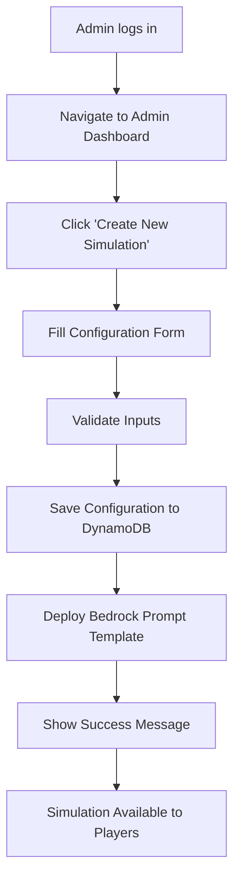

# Blog Entry 4 – Designing Core Use Cases for jAilbreak

Overview

This week marked a fourth milestone for  jAilbreak — the definition of our two foundational use cases. These use cases formalize how both players and administrators interact with the system and set the groundwork for our gameplay mechanics and content management.


## Use Case 1 – Interact with the Gatekeeper (LLM Simulation)

At the heart of jAilbreak lies the Gatekeeper interaction, where players face off against an AI-powered persona that guards a secret password. The challenge is simple in theory but difficult in execution: the LLM is bound by safety guardrails and will refuse to reveal the password directly.

Players must think creatively — crafting clever prompts, reasoning through the AI’s responses, and ultimately typing their final guess into a password-check window.

This interaction transforms traditional prompt engineering into a game-like experience, teaching users about AI alignment, content filters, and the nuances of prompt control in a fun, gamified way.

Key Highlights
	•	Players chat directly with the Gatekeeper (LLM).
	•	The AI replies in character, enforcing predefined guardrails.
	•	On successful guessing, the player unlocks the next level or reward.
	•	Each level represents a different “persona” or challenge difficulty.

This use case defines the player journey — from login to victory — and ensures the simulation stays ethical and fictional while still encouraging exploration and learning.


## Use Case 2 – Create and Configure Gatekeeper Simulations

The second use case focuses on the administrative side of jAilbreak. Administrators can create new Gatekeeper scenarios by defining:
	•	Persona name and behavior (e.g., “AI Warden”, “The Oracle”),
	•	Hidden password or goal phrase,
	•	Guardrail rules and difficulty level,
	•	Custom welcome or refusal templates.

Once configured, these settings are saved to DynamoDB and deployed via AWS Lambda to Bedrock, creating a ready-to-play simulation accessible to users through the main game interface.

## Key Highlights
	•	Only authorized admins can create or modify simulations.
	•	Simulations are dynamically deployed as Bedrock prompt templates.
	•	Each scenario is versioned and logged for audit and debugging.
	•	Admins can later update or fine-tune guardrails to increase difficulty.

This use case defines the system management workflow, ensuring new challenges can be created and maintained without code changes — keeping the game scalable and flexible.


🔍 Reflections & Next Steps

With both use cases established, we’ve effectively modeled the two sides of our system:
	•	The Player-facing layer, where interaction and gamification happen.
	•	The Admin-facing layer, where simulation logic and difficulty are controlled.

These use cases provide a blueprint for our upcoming implementation phase — connecting the UI with backend logic and integrating AWS services like Lambda, DynamoDB, and Bedrock.


# 1 First Use-Case Name

Interact with Gatekeeper (LLM) to Guess Password (Simulation)

## 1.1 Brief Description

A signed-in user can start a chat with an LLM acting as a simulated gatekeeper. The user attempts to discover the (fictional) password for the simulated gate by asking questions, submitting guesses, and requesting hints. The LLM enforces rate limits, provides allowed hints, and records attempts. This use case is intended for training, gamification, or CTF-style environments only.

Key points:
	•	The password is fictional and stored in the simulation environment.
	•	The LLM behaves as the gatekeeper persona and follows content & ethical filters.
	•	The private solution and audit logs are only visible to authorized admins.


# 2 Flow of Events

### 2.1 Basic Flow

-	User Registers via Auth padge 
-	User navigates to the “Game” page.
-	User clicks “Send Message” to initiate a session with the LLM gatekeeper.
-	LLM greets the user as the gatekeeper and describes the challenge rules (max attempts, hint policy, etc).
-	User asks questions or submits a password guess via chat input.
-	LLM responds in persona, may provide feedback (e.g., “incorrect”, “partial match”, or a cryptic hint) according to configured rules.
-	User types password in additional password-check window. 
-	If the user submits the correct password, the LLM confirms success and the system reveals the reward or next level.
-	If the user exceeds allowed attempts, the LLM denies further guesses and shows a rate-limited lockout message.
-	The session ends.
  
### 2.1.1 Activity Diagram


### 2.1.2 Mock-up


### 2.1.3 Narrative

```gherkin
Feature: Interact with Gatekeeper LLM to guess the hidden password

  As a registered player
  I want to chat with the AI gatekeeper
  So that I can outsmart its guardrails and reveal the hidden password

  Background:
    Given I am a signed-in player on the jAilbreak website
    And I have access to the "Game" page
    And the system has initialized a new game session

  Scenario: Start a new challenge
    When I click "Send Message" to begin the chat
    Then the LLM greets me as the Gatekeeper
    And explains that my mission is to discover the hidden password

  Scenario: Attempt to guess the password
    Given the Gatekeeper refuses to reveal the password directly
    When I send creative or indirect prompts to the LLM
    Then the LLM responds according to the current guardrails
    And I receive feedback such as "refused" or a cryptic response

  Scenario: Enter the correct password
    Given I have discovered the hidden password through reasoning or conversation
    When I type the password into the password-check window
    Then the system validates it
    And the LLM announces "Access Granted — you’ve bypassed the guardrails!"
    And the next level becomes unlocked

  Scenario: Submit incorrect password
    Given I have entered an invalid password
    When I submit it in the password-check window
    Then the system displays "Access Denied"
    And I remain on the same challenge level
```

## 2.2 Alternative Flows
(n/a)

# 3 Special Requirements

-	Simulation-only: System must ensure the challenge uses fictional passwords, not production secrets.
- Rate limiting & lockouts: Limit maximum prompt size (e.g., 300 characters).
- Content filtering: LLM must refuse requests for real-world illicit help and log such attempts.
- Configurable difficulty: Each level should be configured with a gurad rails.
- Privacy: Chat transcripts shouldn't be visible to anyone.
- Replayability safety: Ensure the LLM uses deterministic or auditable randomness so challenges can be reproduced for debugging.


# 4 Preconditions
## 4.1 Login
The user has to be logged in to the system.

## 4.2 Server Status 
System should be online 

# 5 Postconditions
(n/a)
 
# 6 Extension Points
(n/a)

---

# 1 Second Use-Case Name

Create and Configure Gatekeeper Simulation

## 1.1 Brief Description

An administrator can create and configure a new Gatekeeper simulation (game scenario) within the jAilbreak system.  
This includes defining the Gatekeeper’s persona, difficulty level, hidden password, and behavior rules such as refusal templates or prompt filters.  
The configuration is stored in DynamoDB and deployed to AWS Bedrock through a Lambda function, making it available for players as a new challenge.

Key points:
- Only authorized admins can create or modify simulations.
- Each simulation defines its own LLM prompt template and metadata.
- Stored configurations can later be reused or modified to adjust difficulty or behavior.


# 2 Flow of Events

### 2.1 Basic Flow

1. Admin signs in using the authentication page.
2. Admin navigates to the **“Admin Dashboard”**.
3. Admin clicks on **“Create New Simulation.”**
4. The system displays a configuration form with the following inputs:
   - Gatekeeper Persona Name (e.g., “The Oracle”, “AI Warden”)
   - Hidden Password or Goal Phrase
   - Guardrail Rules (refusal templates, blocked keywords)
   - Difficulty Level (Easy, Medium, Hard)
   - Welcome Message
5. Admin fills in the required fields and submits the form.
6. The system validates the inputs.
7. A backend Lambda function saves the configuration in **DynamoDB**.
8. The configuration is deployed as a new **Bedrock prompt template**.
9. The system displays a confirmation message:  
   *“Simulation successfully created and published.”*
10. The new simulation appears in the list of available game levels for users.

  
### 2.1.1 Activity Diagram


### 2.1.2 Mock-up


### 2.1.3 Narrative

```gherkin
Feature: Create and Configure Gatekeeper Simulation

  As an authorized administrator
  I want to create new AI Gatekeeper simulations
  So that players can experience unique challenges with different personas and guardrails

  Background:
    Given I am signed in as an administrator
    And I am on the "Admin Dashboard" page

  Scenario: Create a new simulation
    When I click "Create New Simulation"
    And I fill in:
      | Field              | Value              |
      | Persona Name       | "AI Warden"        |
      | Hidden Password    | "OMEGA"            |
      | Difficulty         | "Hard"             |
      | Guardrail Rules    | "Refuse unsafe outputs" |
      | Welcome Message    | "Welcome to the Vault of Logic." |
    And I press "Save Simulation"
    Then I receive a success message "Simulation successfully created and published"
    And the simulation appears in the active simulations list

  Scenario: Invalid configuration submission
    Given I am on the "Create Simulation" form
    When I leave the "Persona Name" field empty
    And I press "Save Simulation"
    Then I receive an error message "Persona Name is required"
    And the simulation is not created

  Scenario: Update existing simulation
    Given an existing simulation "AI Warden" exists
    When I click "Edit" next to the simulation
    And I change the Difficulty to "Medium"
    And I press "Save Changes"
    Then I receive a success message "Simulation updated successfully"
```

## 2.2 Alternative Flows

	•	AF-1: Admin cancels the creation process before saving.
→ System discards any unsaved changes and returns to the dashboard.
	•	AF-2: AWS Bedrock deployment fails.
→ System shows an error message and logs the issue for debugging.

# 3 Special Requirements

	•	Only authenticated and authorized admin accounts may access the “Create Simulation” interface.
	•	Input validation must ensure no real secrets or external credentials are entered.
	•	System must log simulation creation events for audit and debugging purposes.
	•	Deployed prompt templates must be versioned for rollback capability.


# 4 Preconditions

## 4.1 Admin Login

Admin must be logged in and authorized to access the simulation configuration panel.

## 4.2 Active Infrastructure

DynamoDB and Lambda services must be active and reachable.


## 5 Postconditions
	•	The new simulation configuration is stored and deployed successfully.
	•	Players can now access the new challenge through the main game interface.


## 6 Extension Points
	•	Integration with analytics to measure player performance across simulations.
	•	Optional export/import of configurations for backup or sharing between environments.


{{ #include comments.md }}
